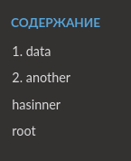
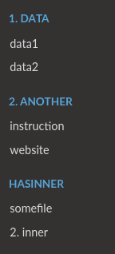
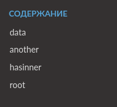
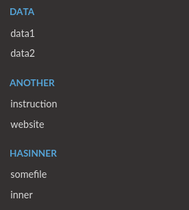

# sphinx-autotoc

**sphinx-autotoc** - это расширение [Sphinx](https://www.sphinx-doc.org/en/master/)
для автоматической генерации содержания сайта 
([toctree](https://www.sphinx-doc.org/en/master/usage/restructuredtext/directives.html#table-of-contents)).

Расширение обходит содержимое папки **src** и автоматически создает toc-файлы. 
В toc-файлах находится директива ``toctree``, в которую включены все файлы и папки, расположенные на одном уровне.

Таким образом, **sphinx-autotoc** генерирует содержание, которое полностью повторяет структуру файлов и папок в папке **src**.
Это избавляет от необходимости обновлять директивы ``toctree`` вручную при каждом добавлении нового файла в документацию.

> [!IMPORTANT]
> Для корректной работы расширения, исходные файлы документации должны находиться в папке `src`, в корне документации.

> [!IMPORTANT]
> Все папки, имена которых начинаются на символ ``_`` игнорируются и не добавляются в содержание в любом случае.

Кроме того, **sphinx-autotoc** может добавлять в содержание документацию по коду, сгенерированную расширением 
[sphinx.ext.autosummary](https://www.sphinx-doc.org/en/master/usage/extensions/autosummary.html).

> [!WARNING]
> sphinx-autotoc взаимодействует с содержанием сайта, поэтому возможны конфликты с другими подобными расширениями.


## Использование

### Установка

```bash
pip install sphinx-autotoc
``` 

Расширение добавляется в файл конфигурации sphinx (**conf.py**), так же как и другие расширения sphinx:

```python
extensions = [
    ...
    'sphinx_autotoc',
    ...
]
```

### Настройка

У расширения есть 3 параметра, которые задаются переменными в **conf.py**.

#### ``sphinx_autotoc_get_headers_from_subfolder``

Определяет способ генерации заголовков в содержании.

Заголовок содержания - это некликабельный текст, с помощью которого можно 
разделить содержание на логические части.

Возможные значения:

- ``False``

  В содержании будет один заголовок, текст для которого указывается в ``sphinx_autotoc_header`` (см. ниже),

  Каждая папка внутри **src** станет кликабельным элементом содержания.

  Отдельные документы (.rst, .md) внутри папки **src** также будут отображаться в содержании.
  
- ``True``

  Количество заголовков в содержании будет равно количеству папок в папке **src**. Текст заголовков будет
  взят из названий этих папок.

  Папки второго уровня (например, **src/header_folder/content_folder**) станут кликабельными элементами
  содержания.
  
  Отдельные документы внутри папки **src** не будут отображаться в содержании.

Значение по умолчанию - ``False``.

#### ``sphinx_autotoc_header`` 

Используется только при ``sphinx_autotoc_get_headers_from_subfolder = False``.

Задает текст заголовка. Значение по умолчанию - **Содержание**.

#### ``sphinx_autotoc_trim_folder_numbers``

По умолчанию сортировка папок в содержании происходит по алфавиту.

Для того чтобы папки в содержании располагались в нужном порядке, можно добавить числа в начало названий папок.
Однако, в этом случае в содержании все папки будут отображаться с числами, что некрасиво.

С помощью данного флага можно убрать числа перед названиями папок в содержании, сохранив сортировку.

Возможные значения: 

- ``False``

  В содержание сайта выводится полное название папки

- ``True``

  В содержании сайта выводится название папки без числа в начале

  Папки должны быть пронумерованы следующим образом:
  
  ``<folder_order>. <folder_name>``
  
  , где:
  
    * **<folder_order>** - число, определяющее порядок папки в содержании сайта

    * **<folder_name>** - название папки

Значение по умолчанию - ``False``


## Примеры конфигурации

Рассмотрим проект со следующей структурой:

```bash
project
├── conf.py
├── ...
└── src
    ├── _hidden_folder
    ├── root.md
    ├── 1. data
    │   ├── data1.rst
    │   └── data2.rst
    ├── 2. another
    │   ├── instruction.rst
    │   └── website.rst
    └── hasinner
        ├── 1. somefile.md
        └── 2. inner
            └── needed_data.rst
```

### Один заголовок

Содержимое **conf.py**:

```python
# Папки в src станут ссылками, отдельные страницы в src отображаются
sphinx_autotoc_get_headers_from_subfolder = False
# Заголовок содержания - "Содержание"
sphinx_autotoc_header = "Содержание"
# Не удалять числа из имен папок
sphinx_autotoc_trim_folder_numbers = False
```

Вид сгенерированного содержания:



### Несколько заголовков

Содержимое **conf.py**:

```python
# Папки в src станут заголовками, отдельные страницы в src не отображаются
sphinx_autotoc_get_headers_from_subfolder = True
# Не удалять числа из имен папок
sphinx_autotoc_trim_folder_numbers = False
```

Вид сгенерированного содержания:



### Один заголовок, отключены числа в содержании

Содержимое **conf.py**:

```python
# Папки в src станут ссылками, отдельные страницы в src отображаются
sphinx_autotoc_get_headers_from_subfolder = False
# Заголовок содержания - "Содержание"
sphinx_autotoc_header = "Содержание"
# Удалить числа из имен папок
sphinx_autotoc_trim_folder_numbers = True
```

Вид сгенерированного содержания:



### Несколько заголовков, отключены числа в содержании

Содержимое **conf.py**:

```python
# Папки в src станут заголовками, отдельные страницы в src не отображаются
sphinx_autotoc_get_headers_from_subfolder = True
# Удалить числа из имен папок
sphinx_autotoc_trim_folder_numbers = True
```

Вид сгенерированного содержания:




## Использование с sphinx.ext.autosummary

Для добавления документации по коду в содержание, нужно добавить файл с именем **autotoc.autosummary.rst**
в папку, в которой должна отобразиться документация.

Первая строка в **autotoc.autosummary.rst** будет заголовком документации по коду в содержании.

Документация будет добавлена в содержание если выполняются **все** нижеперечисленные условия:

1. Включено расширение **sphinx.ext.autosummary**
1. Переменная ``autosummary_generate`` установлена в ``True`` в **conf.py**
1. Файл с директивами ``autosummary`` назван **autotoc.autosummary.rst**
1. Первая строка в файле **autotoc.autosummary.rst** - заголовок документации в содержании

> [!NOTE]
> Если документация по коду не добавляется в содержание, в первую очередь следует убедиться,
> что расширение **autosummary** отрабатывает корректно.
>
> Для проверки можно, например, отключить расширение **sphinx-autotoc** и добавить документацию по коду в содержание
> вручную
>
> [Пример правильного добавления autosummary в содержание](https://github.com/JamesALeedham/Sphinx-Autosummary-Recursion)


### Пример

- **conf.py**:

  ```python
  extensions = [
      ...,
      'sphinx.ext.autosummary',
      ...
  ]
  autosummary_generate = True
  ```

- **autotoc.autosummary.rst**:

  ```rst
  API reference 
  
  .. autosummary::
     :toctree: _autosummary
     :recursive:
     
     python_module_name
  ```

  - **API reference** - заголовок в содержании
  - **python_module_name** - название документируемого python-модуля.

> [!IMPORTANT]
> **python_module_name** должен быть доступен для импорта во время работы sphinx.
>
> Некоторые из способов добиться этого:
> 
> - добавить путь к модулю в ``PYTHONPATH`` перед запуском сборки
> - добавить путь к модулю в ``sys.path`` в **conf.py**
